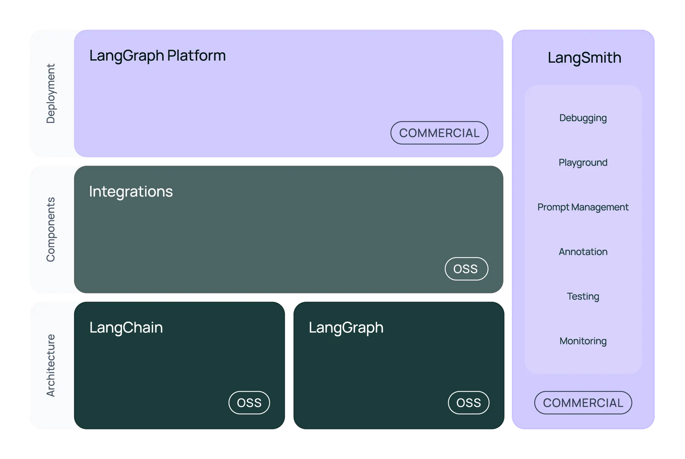

# Recursos do Módulo

[LangChain_Academy_-_Introduction_to_LangGraph_-_Motivation.pdf](attachment:daaae6e0-0df5-4ce1-bf5f-fa1a17cb8237:LangChain_Academy_-_Introduction_to_LangGraph_-_Motivation.pdf)

**Perguntas frequentes sobre o LangGraph**

- **Preciso usar o LangChain para usar o LangGraph? Qual é a diferença?**
    - Não. O LangGraph é um framework de orquestração para sistemas agênticos complexos e é mais simples e controlável do que os agentes do LangChain. Por outro lado, o LangChain fornece uma interface padrão para interagir com modelos e outros componentes, útil para cadeias e fluxos de recuperação simples.
- **Como o LangGraph é diferente de outras estruturas de agentes?**
    - Outras estruturas agênticas podem funcionar para tarefas simples e genéricas, mas não são suficientes para tarefas complexas, adaptadas às necessidades de uma empresa. O LangGraph oferece uma estrutura mais expressiva para lidar com tarefas específicas de cada empresa, sem restringir os usuários a uma única arquitetura cognitiva de caixa-preta.
- **O LangGraph afeta o desempenho do meu aplicativo?**
    - O LangGraph não adicionará nenhuma sobrecarga ao seu código e foi projetado especificamente com fluxos de trabalho de streaming em mente.
- **O LangGraph é de código aberto? É gratuito?**
    - Sim. LangGraph é uma biblioteca de código aberto licenciada pelo MIT e é gratuita para uso.
- **A plataforma LangGraph é de código aberto? é um software proprietário que, eventualmente, será um serviço pago para determinados níveis de uso. Sempre avisaremos com antecedência suficiente antes de cobrar por um serviço e recompensaremos nossos primeiros usuários com preços preferenciais.**
    - Não. [A Plataforma LangGraph](https://langchain-ai.github.io/langgraph/cloud/)
        
        **é um software proprietário que, eventualmente, será um serviço pago para determinados níveis de uso. Sempre avisaremos com antecedência suficiente antes de cobrar por um serviço e recompensaremos nossos primeiros usuários com preços preferenciais.**
        
- **Como habilito a plataforma LangGraph? .**
    - Por enquanto, a Plataforma LangGraph está em fase beta. Durante o período beta, todos os usuários do LangSmith nos planos Plus e Enterprise podem acessar a Plataforma LangGraph. Confira a [documentação](https://langchain-ai.github.io/langgraph/cloud/)
        
        **.**
        
- **Qual a diferença entre LangGraph e LangGraph Platform? .**
    - LangGraph é um framework de orquestração com estado que oferece controle adicional aos fluxos de trabalho dos agentes. A Plataforma LangGraph é um serviço para implantação e escalonamento de aplicativos LangGraph, com um Studio integrado para prototipagem, depuração e compartilhamento de aplicativos LangGraph. Para saber mais, confira a tabela de comparação nas Perguntas Frequentes, no final [desta página](https://www.langchain.com/langgraph)
        
        **.**
        
- **Como o LangGraph se encaixa no ecossistema LangChain?**
    - Nosso objetivo é simplificar cada etapa do
        
        ciclo de vida da inscrição no LLM.
        
        - **Desenvolvimento:**
            
            Crie seus aplicativos usando os blocos de construção, componentes e integrações de terceiros de código aberto do LangChain. Use o LangGraph para criar agentes com estado com streaming de primeira classe e suporte humano no loop.
            
        - **Produção:**
            
            use o LangSmith para inspecionar, monitorar e avaliar suas cadeias, para que você possa otimizar e implantar continuamente com confiança.
            
        - **Implantação:**
            
            transforme seus aplicativos LangGraph em APIs e assistentes prontos para produção com a plataforma LangGraph.
            

# **Lição 2: Gráfico Simples**

- Referência do notebook: simple-graph.ipynb
- Baixe o Notebook no [**GitHub**](https://github.com/langchain-ai/langchain-academy/blob/main/module-1/simple-graph.ipynb)
- Ver o Notebook no [**Google Colab**](https://colab.research.google.com/github/langchain-ai/langchain-academy/blob/main/module-1/simple-graph.ipynb)

---

**Lição 3: LangGraph Studio**

- [Estúdio LangGraph](https://studio.langchain.com/)
- [GitHub: Estúdio LangGraph](https://github.com/langchain-ai/langgraph-studio)
- Baixe os arquivos do Módulo 1 do LangGraph Studio no [**GitHub**](https://github.com/langchain-ai/langchain-academy/tree/main/module-1/studio)

---

**Lição 4: Corrente**

- Referência do notebook: chain.ipynb
- Baixe o Notebook no [**GitHub**](https://github.com/langchain-ai/langchain-academy/blob/main/module-1/chain.ipynb)
- Ver o Notebook no [**Google Colab**](https://colab.research.google.com/github/langchain-ai/langchain-academy/blob/main/module-1/chain.ipynb)

---

**Lição 5: Roteador**

- Referência do notebook: router.ipynb
- Baixe o Notebook no [**GitHub**](https://github.com/langchain-ai/langchain-academy/blob/main/module-1/router.ipynb)
- Ver o Notebook no [**Google Colab**](https://colab.research.google.com/github/langchain-ai/langchain-academy/blob/main/module-1/router.ipynb)

---

**Lição 6: Agente**

- Referência do notebook: agent.ipynb
- Baixe o Notebook no [**GitHub**](https://github.com/langchain-ai/langchain-academy/blob/main/module-1/agent.ipynb)
- Ver o Notebook no [**Google Colab**](https://colab.research.google.com/github/langchain-ai/langchain-academy/blob/main/module-1/agent.ipynb)

---

**Lição 7: Agente com Memória**

- Referência do notebook: agent-memory.ipynb
- Baixe o Notebook no [**GitHub**](https://github.com/langchain-ai/langchain-academy/blob/main/module-1/agent-memory.ipynb)
- Ver o Notebook no [**Google Colab**](https://colab.research.google.com/github/langchain-ai/langchain-academy/blob/main/module-1/agent-memory.ipynb)

---

**[Opcional] Lição 8: Implantação**

**Atualmente, a Plataforma LangGraph está disponível apenas para usuários do plano LangSmith Plus. A Lição 8 deste curso é opcional.**

- Referência do Notebook: deployment.ipynb
- Baixe o Notebook no [**GitHub**](https://github.com/langchain-ai/langchain-academy/blob/main/module-1/deployment.ipynb)
- Ver o Notebook no [**Google Colab**](https://colab.research.google.com/github/langchain-ai/langchain-academy/blob/main/module-1/deployment.ipynb)